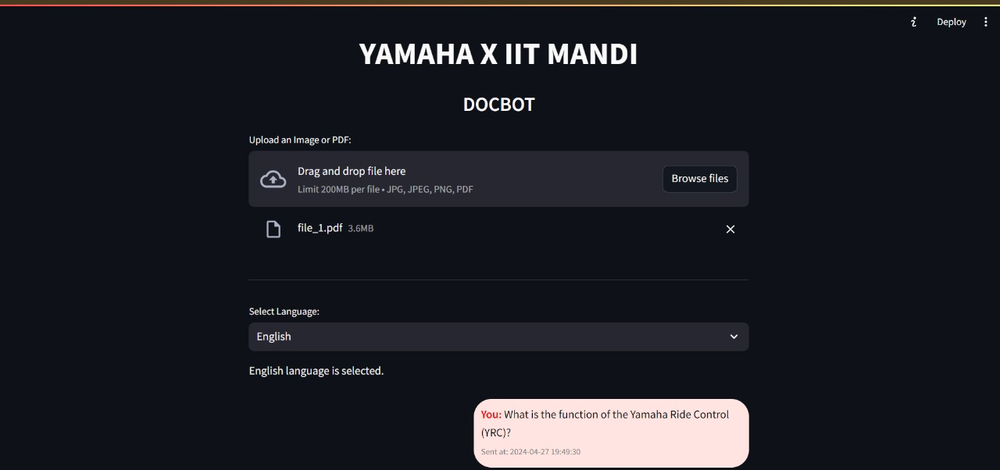
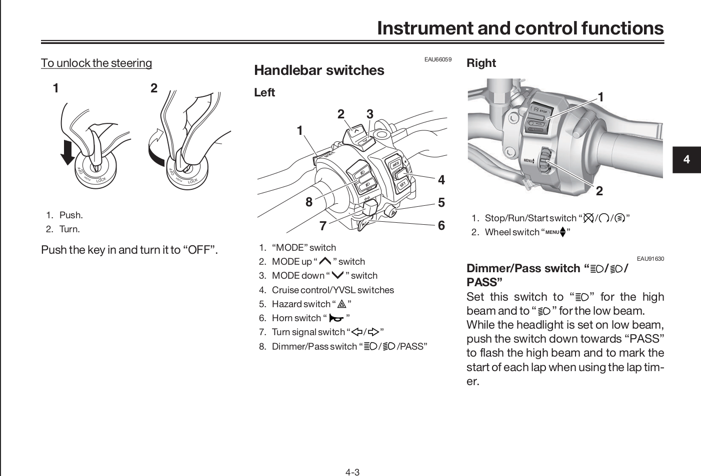
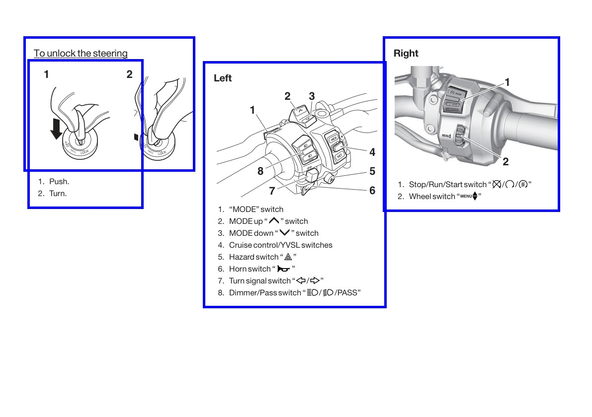

# DocBot

DocBot is a RAG-based streamlit application that processes PDF files and allows users to query information from the provided texts. Relevant images (if they exist) are also returned.

## Features

### Chatbot Interface



### Image Extraction
<table>
  <tr>
    <td></td>
    <td></td>
  </tr>
</table>


## Setup

1. Clone the repository:
    ```sh
    git clone https://github.com/yourusername/DocBot.git
    cd DocBot
    ```

2. Create a virtual environment and activate it:
    ```sh
    python -m venv venv
    source venv/bin/activate  # On Windows use `venv\Scripts\activate`
    ```

3. Install the required packages:
    ```sh
    pip install -r requirements.txt
    ```

4. Create a `.env` file and add your API keys:
    ```plaintext
    HUGGINGFACEHUB_API_TOKEN=your_huggingfacehub_api_token
    GENAI_API_KEY=your_genai_api_key
    ```

5. Run the application:
    ```sh
    streamlit run DocBot.py
    ```

## Usage

1. Upload the PDF file(s) using the file uploader.
2. Click Submit.
3. Query information from the provided texts. Relevant images (if they exist) will also be returned.
4. If you want to ask a question without the previous chat history, click the "New chat" button (after providing PDF).
5. You can also access previous chats from the sidebar.

## Requirements

- Python 3.7+
- See `requirements.txt` for the list of required packages.


